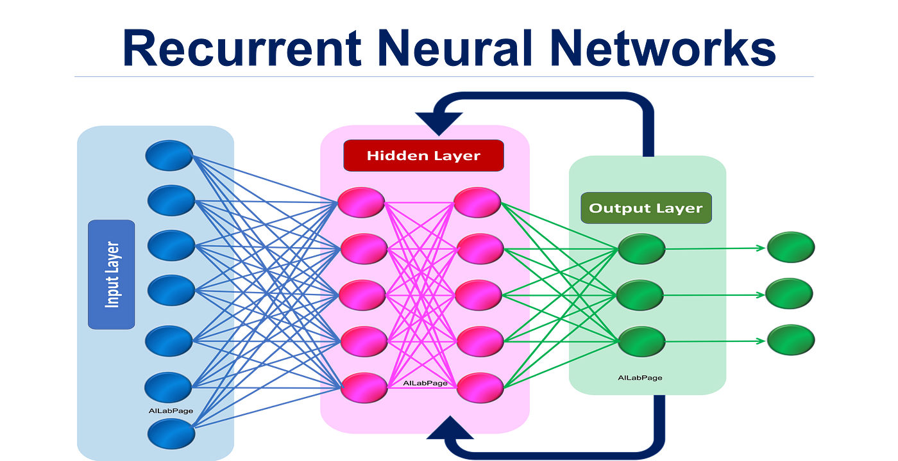

# Generating Poetic Texts with RNN

#### Overview
This project uses a Recurrent Neural Network (RNN) to generate poetic text based on the works of Shakespeare. The model is built using TensorFlow and Keras, and it generates new text sequences that mimic Shakespeare's style.

#### Key Features:
1. Converts Shakespeare's text into a suitable format for training the RNN
2. Uses an LSTM-based RNN to learn the patterns in the text
3. Generates new text sequences based on the trained model

!